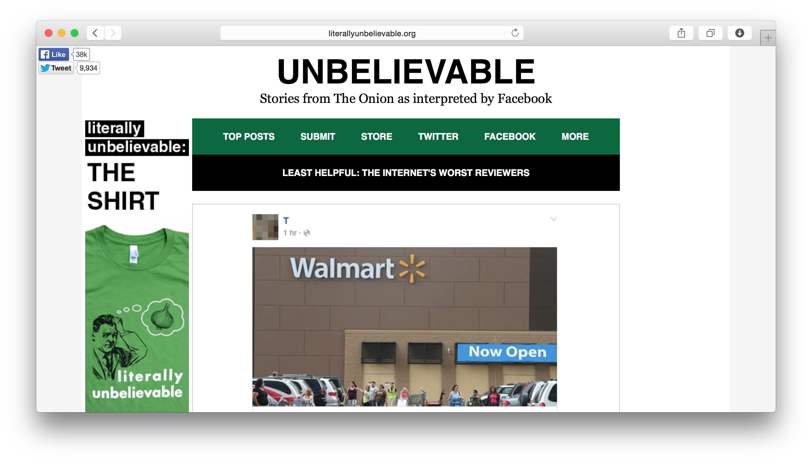
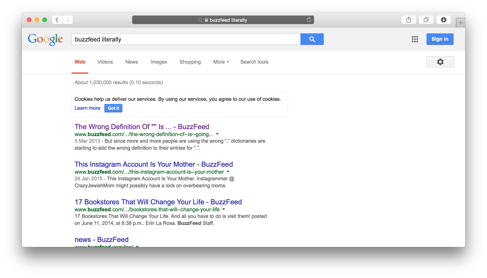

# Literally Can't Even

Kills the word 'literally' with fire. By not showing it on the page.

See? Much better.

## Manual Installation

### Safari

Download `literally-cant-even.safariextz`, and then double click it.

### Firefox

Download `literally-cant-even.xpi`, then drag and drop the file into the browser.

### Chrome

Download `literally-cant-even.crx`, then go to Chrome's preferences, Extensions, enable Developer mode, and drag the file into the window.

## Development

1. Clone the repo
2. Make changes for each browser
3. Run `make` to get new packages. Except for Safari.

## Credit

To [panicsteve](https://github.com/panicsteve/cloud-to-butt), [DaveRandom](https://github.com/DaveRandom/cloud-to-butt-mozilla) and [LoganCollins](https://github.com/logancollins/cloud-to-butt-safari), whose existing work made life much easier. :) 
